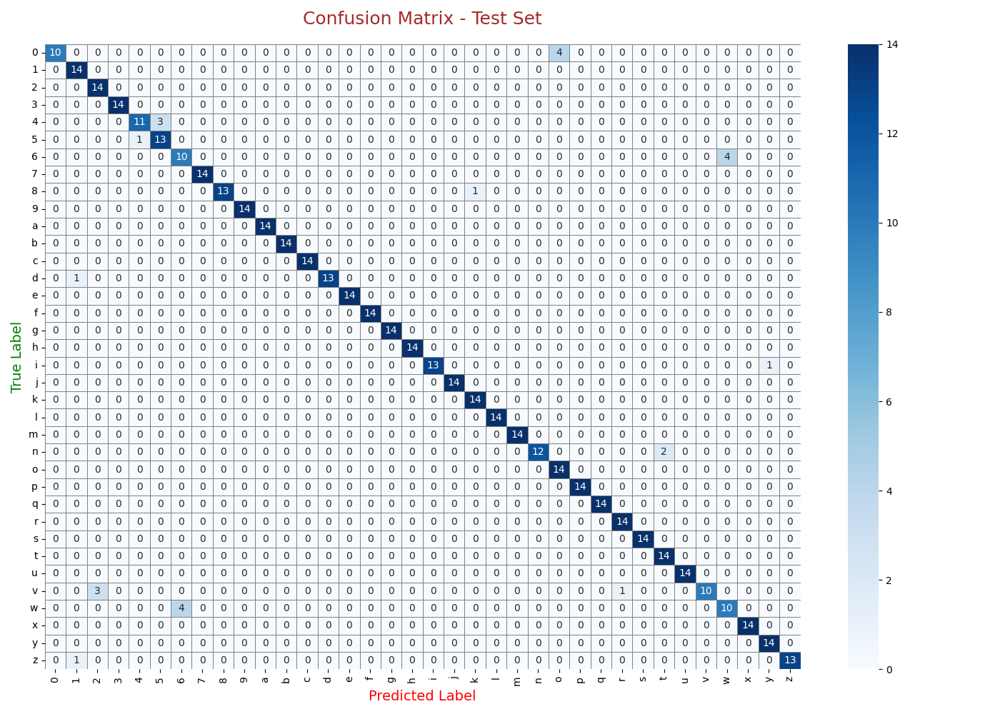

# Sign-Language-Recognition-System
Deep Learning–based American Sign Language (ASL) recognition system using CNN and EfficientNetB0 transfer learning architecture. The project classifies ASL hand gestures (A–Z and 0–9) from image inputs using computer vision, data augmentation, fine-tuning, and performance evaluation techniques, achieving approximately 95% accuracy.

# 🤟 ASL Recognition Using CNN

## 📌 Project Overview

ASL Recognition Using CNN is a Deep Learning–based computer vision project designed to recognize and classify American Sign Language (ASL) hand gestures from image inputs.

The system utilizes Convolutional Neural Networks (CNNs) with an EfficientNetB0 transfer learning architecture to accurately classify ASL gestures representing:

* A–Z alphabets
* 0–9 numerical signs

The primary objective of this project is to improve accessibility and communication support for deaf and hard-of-hearing individuals through intelligent gesture recognition systems.

---

# 🎯 Problem Statement

Communication barriers remain a major challenge for individuals who rely on sign language for daily interaction. Traditional interpretation methods are often limited, slow, or unavailable in real-time scenarios.

This project aims to develop an AI-powered ASL recognition system capable of accurately identifying sign language gestures from RGB images using Deep Learning and Computer Vision techniques.

---

# 🚀 Project Objectives

* Collect and preprocess ASL gesture image datasets
* Apply image augmentation techniques to improve generalization
* Develop a CNN-based gesture recognition model
* Implement EfficientNetB0 transfer learning architecture
* Achieve high classification accuracy on unseen test data
* Evaluate model performance using visual analytics and evaluation metrics
* Build a scalable foundation for real-time ASL recognition systems

---

# ⚙️ Technologies Used

* Python
* TensorFlow
* Keras
* EfficientNetB0
* NumPy
* Pandas
* Matplotlib
* Seaborn
* OpenCV
* Scikit-learn
* Google Colab

---

# 🧠 Deep Learning Architecture

The project is built using:

* Convolutional Neural Networks (CNN)
* EfficientNetB0 Transfer Learning
* Adam Optimizer
* Categorical Crossentropy Loss Function

Additional optimization techniques:

* Batch Normalization
* Dropout Regularization
* Data Augmentation
* Fine-Tuning
* Early Stopping

---

# 📂 Dataset Information

### Dataset

American Sign Language (ASL) Gesture Dataset

### Classes Included

* A–Z Hand Gestures
* 0–9 Numeric Gestures

### Preprocessing Techniques

* Image Resizing
* Normalization
* Data Augmentation
* Train-Validation-Test Split

---

# 📊 Model Performance

The trained model achieved strong classification performance across training, validation, and testing datasets.

| Metric              | Performance |
| ------------------- | ----------- |
| Training Accuracy   | 94–96%      |
| Validation Accuracy | ~95%        |
| Test Accuracy       | ~95%        |

The model demonstrated stable convergence and strong generalization capability on unseen gesture samples.

---

# 📈 Visualizations

## Accuracy & Loss Curves


---

## Confusion Matrix



---

## Model Predictions


---

# 📌 Key Findings

* EfficientNetB0 delivered excellent performance even with a limited dataset.
* Transfer learning significantly improved training efficiency and accuracy.
* Data augmentation helped reduce overfitting and improved model generalization.
* Minor misclassifications occurred between visually similar ASL gestures.

---

# 📚 Learning Outcomes

Through this project, the following concepts and skills were explored:

* Deep Learning fundamentals
* Convolutional Neural Networks (CNNs)
* Transfer Learning implementation
* Image preprocessing and augmentation
* Model evaluation techniques
* Confusion matrix interpretation
* Performance optimization and fine-tuning
* Real-world computer vision applications

---

# 🚀 Future Improvements

Potential future enhancements include:

* Real-time webcam gesture recognition
* Mobile application deployment
* Real-time ASL sentence translation
* Voice output integration
* Expanded gesture vocabulary support
* Cloud deployment for scalable inference

---

# 📂 Project Structure

```bash
ASL-Recognition-Using-CNN/
│
├── ASL_PBL_Final.ipynb
├── README.md
├── requirements.txt
├── .gitignore
│
├── docs/
│   ├── PBL_Report.docx
│   └── pbl.pptx
│
├── images/
│   ├── confusion_matrix.png
│   ├── accuracy_plot.png
│   ├── loss_plot.png
│   └── model_output.png
```

---

# ▶️ How to Run the Project

## Install Dependencies

```bash
pip install -r requirements.txt
```

## Run Jupyter Notebook

```bash
jupyter notebook
```

Open:

```bash
ASL_PBL_Final.ipynb
```

# 🧠 Conclusion

This project demonstrates how Deep Learning and CNN-based transfer learning architectures can be effectively applied to gesture recognition and accessibility-focused AI systems.

The achieved accuracy of approximately 95% highlights the effectiveness of EfficientNet-based ASL recognition for real-world sign language interpretation applications.
